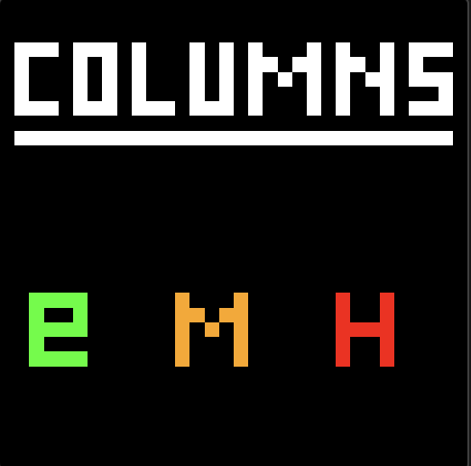
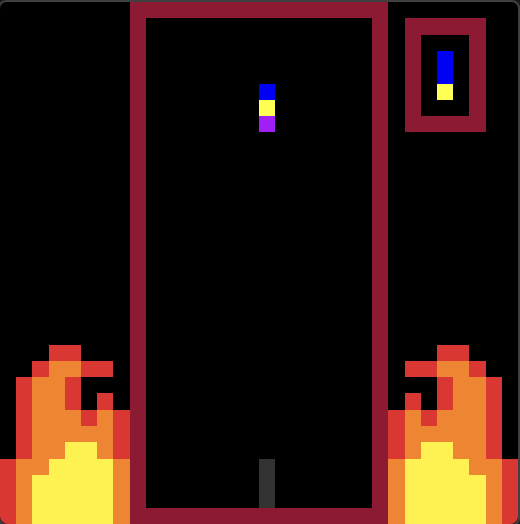
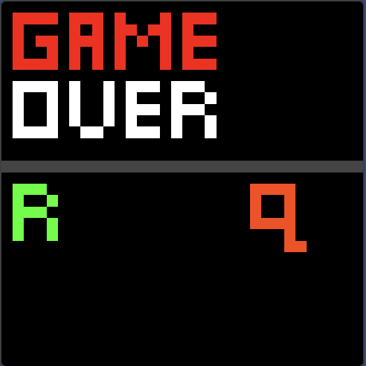

# Columns_CSC258
Demo of a Columns puzzle game built in MIPS assembly, implementing: gravity, match chains, ghost piece, next-piece preview, pause, sound effects, 3 difficulty levels. (Source not public)

# Columns (MIPS Assembly) — Demo

A recreation of the classic falling-gems puzzle game **Columns**, written entirely in **MIPS assembly** and rendered on a 32×32 bitmap display using memory-mapped I/O.

> **Note:** This repository is a demo and showcase only. The source code is not published.

<!-- Add your recorded demo here once you have it, e.g.:

-->

| Start screen | Gameplay | Game over |
|:---:|:---:|:---:|
|  |  |  |

| Gameplay Demo |
| :----------:|
|  |

## Features

- **Core gameplay:** falling 3-gem columns with left/right movement, shuffling, and hard drop
- **Match clearing:** 3+ gems in a row (horizontal, vertical, or diagonal) disappear, and **chain reactions** are detected automatically
- **Gravity** that speeds up over time
- **Easy / Medium / Hard** difficulty selection
- **Ghost outline** showing where the current column will land
- **Next-column preview** panel
- **Pause** with the board saved and restored
- **Game over screen** with retry or quit
- **Sound effects** for shuffling, moving, dropping, matching, and game over
- Decorative pixel-art flames along the playfield

## Controls

| Key | Action |
|:---:|--------|
| `e` / `m` / `h` | Choose Easy / Medium / Hard on the start screen |
| `a` / `d` | Move column left / right |
| `w` | Shuffle the gems in the column |
| `s` | Drop the column to the bottom |
| `p` | Pause / resume |
| `q` | End the game |
| `r` / `q` | On the game over screen: retry / quit |

## Technical highlights

- **Display:** all graphics are drawn by writing colour values directly to a memory-mapped 32×32 bitmap display.
- **Input:** the keyboard is polled through memory-mapped I/O.
- **Efficient match detection:** vertical, horizontal, and diagonal checks scan only the rows and columns that can be affected rather than the entire screen, and re-run after each clear to catch cascades.
- **Compact design:** shared routines for drawing, erasing, and colour generation are reused across features.

## Author

Adish Singh. Built as a solo project.
